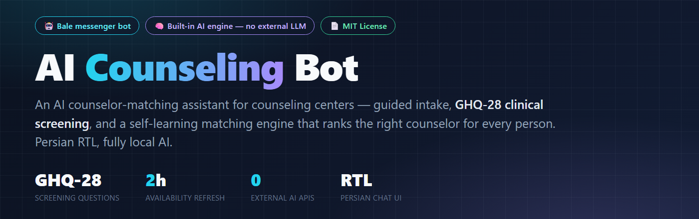
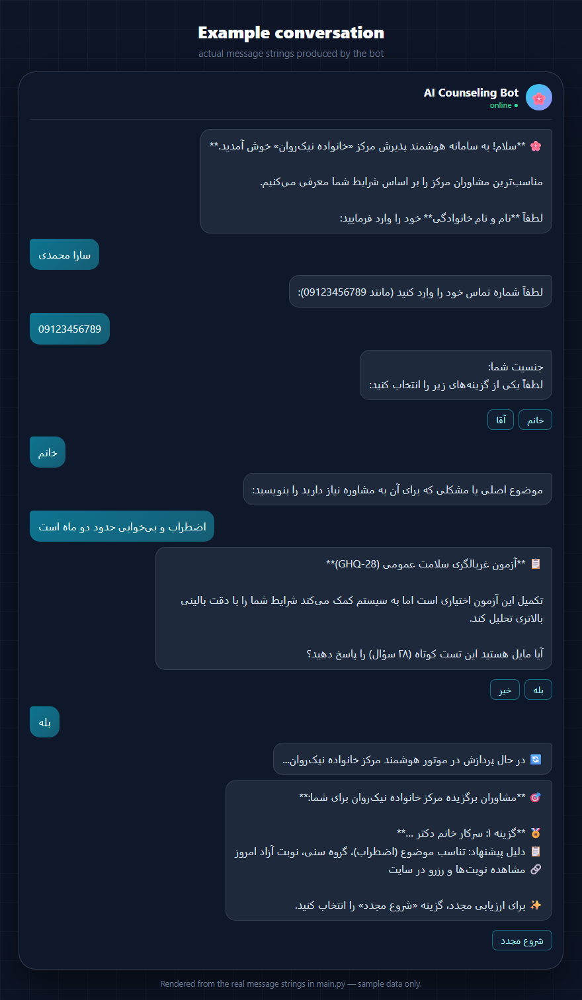
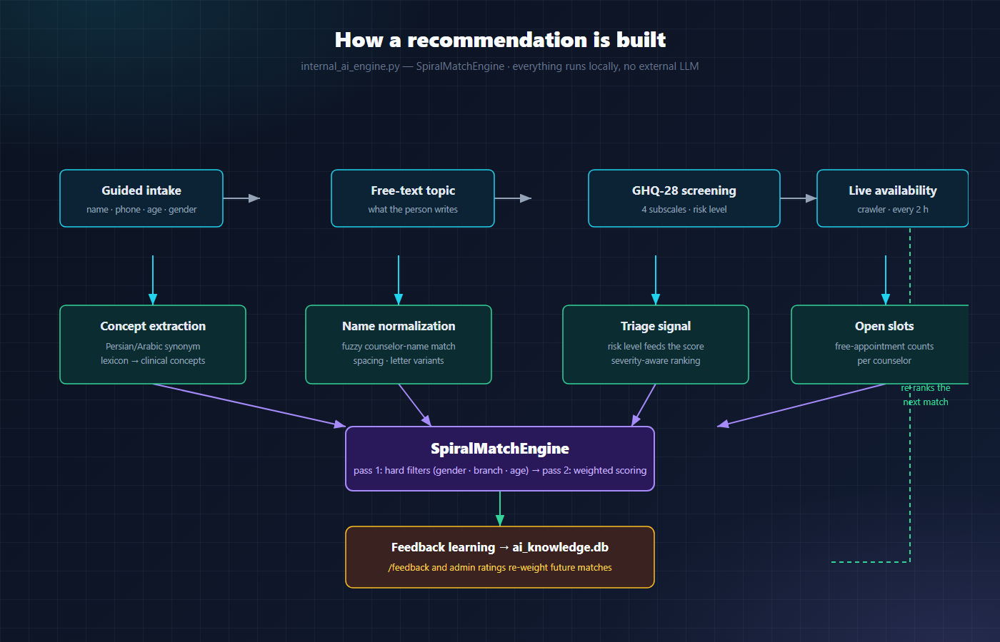

<p align="center">
  
</p>

<h1 align="center">AI Counseling Bot</h1>

<p align="center">
  <b>An AI counselor-matching assistant for the <a href="https://bale.ai">Bale</a> messenger.</b><br>
  Guided intake → GHQ-28 screening → a self-learning engine ranks the right counselor.
</p>

<p align="center">
  <a href="LICENSE"></a>
  
  
  
  
  <a href="https://github.com/Mohammad-Hasan-Kaman/ai-counseling-bot/stargazers"></a>
</p>

<p align="center">
  <a href="#-example-conversation">Example</a> ·
  <a href="#-why-ai">Why AI</a> ·
  <a href="#-highlights">Highlights</a> ·
  <a href="#-quick-start">Quick start</a> ·
  <a href="#-admin-commands">Admin</a> ·
  <a href="#-project-layout">Layout</a>
</p>

---

Users answer a short guided intake, optionally take the **GHQ-28** wellbeing screening, and the
bot's **built-in AI engine** ranks the counselors that fit their situation — gender and branch
preferences, topic, age range, and live appointment availability. Admins manage everything
in-bot: statistics, broadcasts, Excel data export/import, and feedback that trains the engine.

The conversation UI is in Persian (RTL); all code, comments and documentation are in English.

## 💬 Example conversation

<p align="center">
  
</p>

Every recommendation comes with a **"why this match"** line — topic fit, age group, and an open
slot the person can actually book.

## 🧠 Why "AI"?

The intelligence is **built into the bot itself** — no external API, no cloud LLM, no
per-message cost, and no user data leaving the machine.

<p align="center">
  
</p>

| Component | What it does |
|---|---|
| **SpiralMatchEngine** | Two-pass ranking: hard filters (gender, branch, age bounds) followed by weighted scoring across topic fit, concept match, and free-appointment count |
| **Concept extraction** | Maps free-text topics/expectations to clinical concepts via an expanded synonym dictionary (Persian/Arabic variants included) |
| **Name normalization** | Fuzzy counselor-name matching (spacing, Arabic/Persian letter variants, nicknames) so user input never has to be exact |
| **Clinical triage** | GHQ-28 screening (28 questions) scored and interpreted for risk level, fed into the ranking |
| **Feedback learning** | Every recommendation and admin rating writes to `ai_knowledge.db`; positive/negative signals re-weight future matches (`/feedback`, `/learning`) |
| **Availability awareness** | A crawler refreshes open-slot counts every 2 hours so the engine prefers counselors the user can actually book |

The engine hot-reloads whenever an admin uploads a new counselors spreadsheet — no restart
needed.

## ✨ Highlights

- **Guided intake flow** — name, phone, age, gender, topic, previous-therapy history,
  expectations, preferred counselor gender, branch preference
- **GHQ-28 screening** — 28-question wellbeing check with scored interpretation and
  risk-aware routing
- **AI recommendations** — ranked counselor shortlist with profile links and
  "why this match" context
- **Availability crawler** — scheduled scrape of the public team page (2-hour interval,
  proxy-fallback + retry logic, lock file against overlapping runs)
- **Admin panel** (`/admin`, password-gated with session timeout)
  - `/stats` — live statistics
  - `/export` — two-sheet Excel export of users and request history
  - `/upload` — replace the counselors spreadsheet; engine reloads automatically
  - `/broadcast` — message all users with a confirmation step
  - `/feedback` / `/learning` — train and inspect the matching engine
  - `/crawl` — trigger the availability crawler on demand
- **Repeat-visitor awareness** — returning users get a welcome-back message
- **Graceful errors** — global error handler, cancellation at any step

## 🚀 Quick start

```bash
git clone https://github.com/Mohammad-Hasan-Kaman/ai-counseling-bot.git
cd ai-counseling-bot
pip install -r requirements.txt

cp .env.example .env    # then edit .env — see below
python main.py
```

### Configuration (`.env`)

| Variable | Description |
|---|---|
| `BOT_TOKEN` | Bale bot token (create the bot via Bale's bot father) |
| `ADMIN_USER_IDS` | Comma-separated Bale user IDs allowed into the admin panel — find yours with `/myid` |
| `ADMIN_PANEL_PASSWORD` | Password for `/admin` |

No secret is stored in the code — all credentials are read from the environment.

### Requirements

- Python 3.9+
- `python-telegram-bot` (pointed at `https://tapi.bale.ai/bot`), `APScheduler`,
  `requests`, `beautifulsoup4`, `pandas`, `openpyxl`, `python-dotenv`

## 🛠 Admin commands

| Command | Action |
|---|---|
| `/admin <password>` | Open the admin panel |
| `/logout` | End the admin session |
| `/stats` | System statistics |
| `/export` | Download user data as Excel |
| `/upload` | Upload a new counselors Excel file (hot reload) |
| `/broadcast` | Send a message to every user (with confirm step) |
| `/crawl` | Run the availability crawler now |
| `/feedback` | Rate a recommendation to train the engine |
| `/learning` | View current learning weights |
| `/myid` | Get your Bale user ID |

## 📁 Project layout

```
main.py                 Bot entry point, conversation flows, admin handlers
internal_ai_engine.py   SpiralMatchEngine — matching, triage, feedback learning
ghq_analyzer.py         GHQ-28 questionnaire, scoring and interpretation
user_db.py              SQLite storage for users and request history
admin_tools.py          Excel export and broadcast helpers
crawler.py              Appointment availability scraper (scheduled)
config.py               Paths, scheduler settings, env-based credentials
excel_to_json.py        One-shot converters for the counselors dataset
load_clean.py           Rebuilds the clean counselors database from Excel
build_clean_mapping.py  Builds the name → profile-URL mapping
extract_links_from_html.py  Extracts team profile links from saved HTML
mapping.json            Counselor name → profile URL map
docs/                   Banner, architecture diagram and conversation mockup
references/             Saved copy of the public team page (crawler input sample)
```

## 🤝 Contributing

Issues and pull requests are welcome — see [CONTRIBUTING.md](CONTRIBUTING.md).
Not a developer? A ⭐ star on the repo helps others find it.

## ⚠️ Disclaimer

This bot supports — but does not replace — professional care. The GHQ-28 output is a
screening signal, not a medical diagnosis. Counselor matching is advisory; users make the
final choice.

## 📄 License

[MIT](LICENSE)
